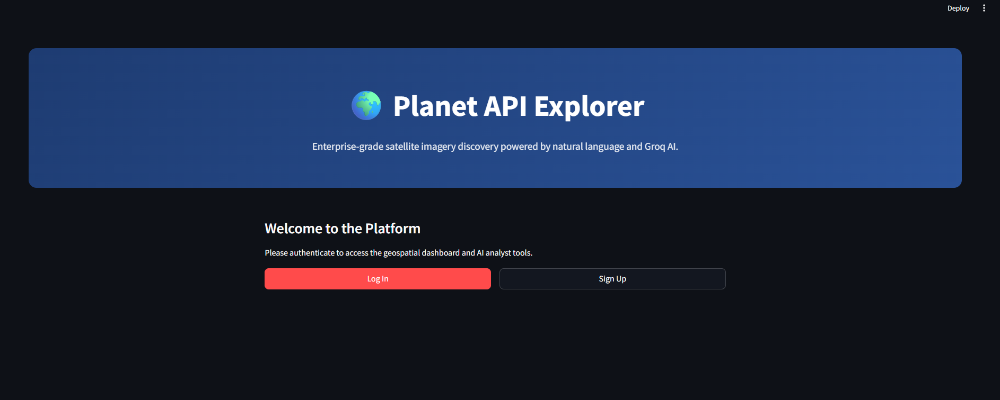
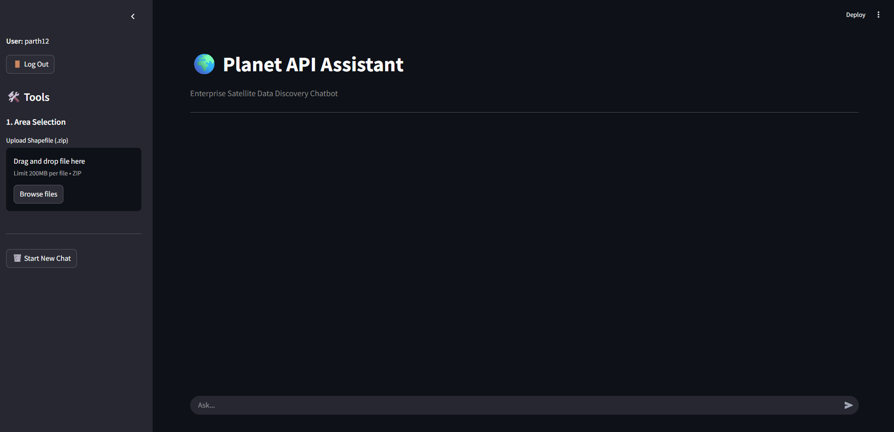
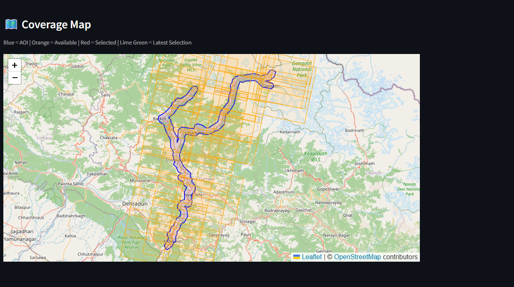
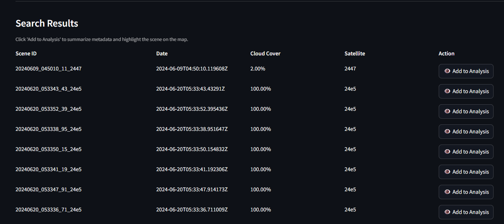
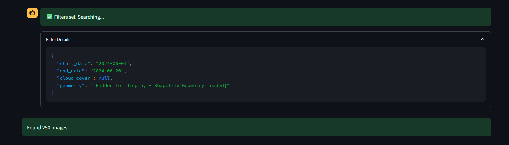
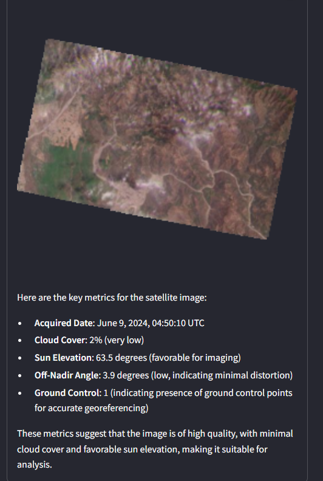

# 🌍 Planet API Assistant (Enterprise Edition)

An intelligent, multi-tier geospatial data discovery platform. This application bridges the gap between complex satellite metadata and natural language, allowing users to query, filter, and analyze Planet API satellite imagery using plain English.

## 🚀 Overview
Traditionally, finding the right satellite imagery requires complex API queries or heavy GIS software. This platform democratizes geospatial analysis by integrating the **Planet API** with the **Groq LLM (LLaMA3)**. Users can simply type what they are looking for (e.g., "Find clear images of this region from last week"), and the AI translates the intent into precise API parameters, retrieves the metadata, maps it, and generates automated intelligence reports.

## 📸 Application Screenshots

### Homepage and login


### Dashboard and chat interface


### Coverage Map with scenes collected


### Satellite Scenes collected


### Filters collected using LLM


###  AI Analysis


## ✨ Key Features
* **Natural Language Data Mining:** Chat interface to query satellite imagery without writing code.
* **Shapefile Integration:** Upload custom `.zip` shapefiles to instantly define complex Areas of Interest (AOIs).
* **Interactive Coverage Maps:** Real-time visualization of your AOI and available satellite scenes using Folium and GeoPandas.
* **AI Metadata Summarization:** Select a scene to automatically generate an executive-ready summary of its technical metadata (cloud cover, off-nadir angle, ground control, etc.).
* **Polyglot Persistence Architecture:**
    * **MySQL:** Permanent, secure storage for user authentication (hashed passwords using `bcrypt`).
    * **SQLite:** Ephemeral cache database for rapid, localized storage of Planet API metadata during active sessions.

---

## 🛠️ Technology Stack
* **Frontend & Routing:** Streamlit (Python)
* **AI & Logic:** Groq API (LLaMA 3 70B), LangChain/Custom LLM routing
* **Geospatial Processing:** GeoPandas, Shapely, Folium
* **Databases:** MySQL (Auth), SQLite3 (Session Cache)
* **Security:** `bcrypt`, `python-dotenv`

---

## 💻 Local Installation & Setup

### 1. Prerequisites
Make sure you have the following installed:
* Python 3.9+
* MySQL Server (Running locally)
* Git

### 2. Clone the Repository
```bash
git clone [https://github.com/parthchr/PLanet-Assistant.git](https://github.com/parthchr/PLanet-Assistant.git)
cd PLanet-Assistant
```
### 3. Create the Virtual Environment & Install Dependencies
Bash
```
python3 -m venv venv
source venv/bin/activate  # On Windows use: venv\Scripts\activate
pip install -r requirements.txt
```
### 4. Database Configuration (MySQL)
Log into your local MySQL server and run the following commands to create the secure user database:
```SQL
CREATE DATABASE planet_app;
USE planet_app;
CREATE TABLE users (
    id INT AUTO_INCREMENT PRIMARY KEY,
    username VARCHAR(50) UNIQUE NOT NULL,
    email VARCHAR(100),
    password_hash VARCHAR(255) NOT NULL,
    created_at TIMESTAMP DEFAULT CURRENT_TIMESTAMP
);
```
### 5. Environment Variables (Secrets)
CRITICAL: Never upload your API keys to GitHub. Create a hidden file named .env in the root directory of the project:
Bash
```
nano .env
```
Paste your credentials into the .env file exactly like this (no quotes or spaces):
PLANET_API_KEY=your_planet_api_key_here
GROQ_API_KEY=gsk_your_groq_api_key_here
MYSQL_PASSWORD=your_mysql_password_here

### 6. Run the Application
Bash
```
streamlit run app.py
```
The app will launch in your browser at http://localhost:8501.

# ☁️ Cloud Deployment (AWS EC2)
To deploy this application to a production environment like AWS: Provision an Ubuntu instance to handle geospatial processing.
Open port 8501 in your AWS Security Group. 
Install dependencies: sudo apt update && sudo apt install python3-pip python3-venv mysql-server -y Configure the MySQL database with a dedicated appuser to bypass Ubuntu root restrictions. 
Clone the repository, manually create the .env file on the server, and install requirements.txt. 
Use a terminal multiplexer like tmux to keep the Streamlit app running in the background:
Bash
```
tmux new -s planetapp
streamlit run app.py
```
# 📖 How to Use the Platform
## Authentication: Upon visiting the site, create a secure account or log in.
## Define Area: Upload a Shapefile (.zip) in the left sidebar, or type a location name into the chat.
## Query: Tell the AI what you are looking for (e.g., "Give me images from May 2024 with under 10% cloud cover").
## Analyze: Review the coverage map. Click "👁️ Add to Analysis" on any scene in the results table to download its thumbnail and generate an AI summary of the scene's quality.
## Reset: Click "Start New Chat" in the sidebar to flush the SQLite cache and begin a new search.
